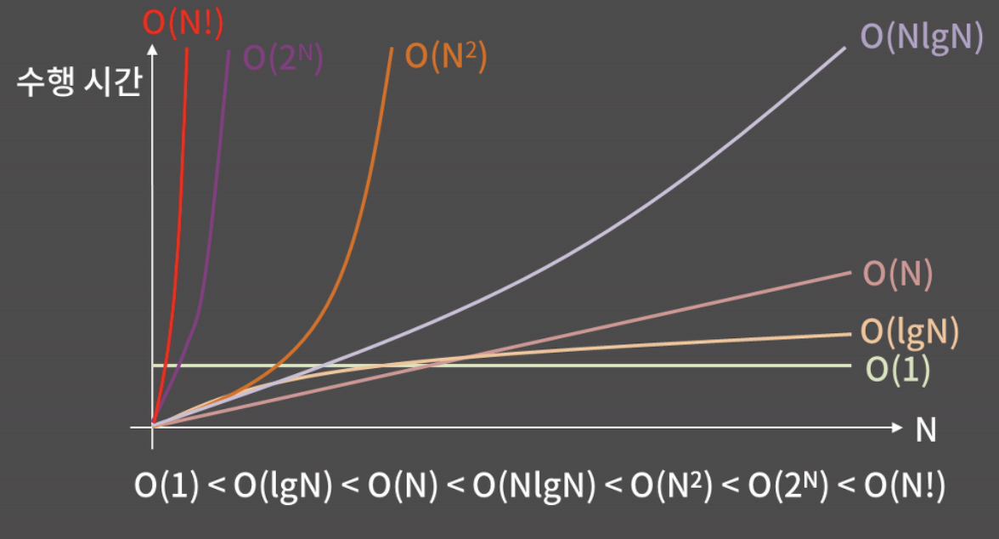
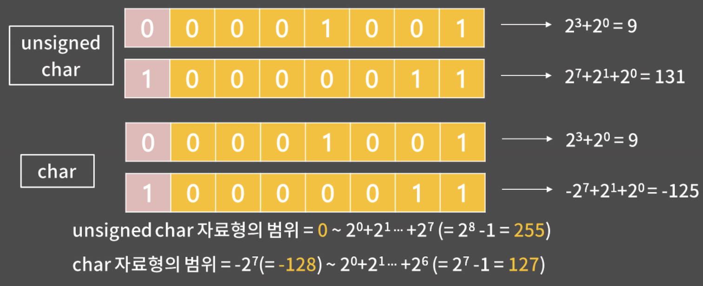

# 기초 코드 작성 요령 1

링크: https://blog.encrypted.gg/922?category=773649
목차: 공간복잡도, 시간복잡도, 실수자료형, 정수자료형
순서: 0x01
스터디 날짜: 2021년 12월 16일
정리일: 2021년 12월 14일

<aside>
💡 기초는 Elementary보다 Primary에 더 가깝다.
쉬워서 기초가 아니라, 꼭 필요해서 기초라고 하기에 어려울 수 있다.

</aside>

# 목차

## 시간복잡도

- 컴퓨터는 1초에 대략 3-5억 개 정도의 연산을 처리할 수 있다.
(단순한 연산인지, 복잡한 연산인지에 따라 차이가 날 수 있지만 어림 잡은 수라고 생각하자)
    
    어떠한 문제의 시간 제한이 1초라고 하면, 이는 나의 프로그램이 3-5억 번의 연산 안에 답을 내고 종료되어야 함을 뜻한다.
    
    아래 함수가 몇 번의 연산을 수행하는 지 보면
    
    ```cpp
    int funcl(int arr[], int n) {
    	int cnt = 0;
    	for (int i = 0; i < n; i++) {
    		if (arr[i] % 5 == 0) cnt++;
    	}
    	return cnt;
    }
    ```
    
    - n에 따라 반복되는 연산
        1. `i < n` i가 n보다 작은 지 확인
        2. `i++` 1번이 true면 증가
        3. `arr[i] % 5` arr[i]를 5로 나눈 나머지 연산
        4. `3번 == 0` 일치하는 지 확인
        5. `cnt++` 일치할 때, cnt 증가
    - 함수에서 한번씩 진행되는 연산
        1. `int cnt = 0` cnt에 0 대입
        2. `int i = 0` i에 0 대입
        3. `return cnt` cnt 반환
    - 연산의 횟수를 계산하면 `5n + 3` 이 나온다.
    
    하지만, 이처럼 코드를 매 실행 단위로 뜯어보는 것은 심각한 노가다로 상수를 제거한 후  
    "n번의 연산이 필요하다."라는 표현을 퉁쳐서 n에 비례한다고 이야기한다.
    

- 코드를 배제한 설명을 아래 예시로 보면,
    - 예시 1
        
        Q. N명의 사람이 한 줄로 서있다. 거기서 이름이 '가나다'인 사람을 찾기 위해 이름을 물어볼 것이다.
        이름을 물어보고 대답을 듣는데까지 1초가 걸린다면 얼마만큼의 시간이 필요할까?
        
        A. 
        
        - Best: 1초
            
            맨 처음 물어본 사람이 '가나다'일 때
            
        - Average: N/2초
            
            평균적으로, 절반쯤 물어볼 때
            
        - Worst: N초
            
            모든 사람에게 다 물어볼 때
            
    - 예시 2
        
        Q. N명의 사람이 한 줄로 서있다. 거기서 이름이 "가나다"인 사람을 찾기 위해 이름을 물어볼 것이다.
        **이 때 사람들은 이름 순으로 서있다.** 이름을 물어보고 대답을 듣는데까지 1초가 걸린다면 얼마만큼의 시간이 필요할까?
        
        A. 
        
        이름이 순서대로 있을 경우,가운데 있는 사람에게 물었을 때, 원하는 이름이 앞에 있는 지, 뒤에 있는 지에 따라 후보군을 반으로 줄일 수 있다.
        
        - Best: 1초
            
            맨 처음 물어본 사람이 '가나다'일 때
            
        - Average: $\log n$초
            
            한 명이 남을 때 까지 절반으로 계속 쪼개지는 상황
            (n이 100명일 때: 100 → 50 → 25 → 12 → 6 → 3 → 1)
            
        - Worst: $\log n$초
            
            수학적 기댓값으론 $(1 - 1 / n)\log n$ 이지만, 
            N이 커질 수록 사실상 0에 가까운 값이니 $\log n$으로 작성
            
        
- **시간복잡도(Time Complexity)**
    
    입력의 크기와 문제를 해결하는데 걸리는 시간의 상관관계
    
    보통 시간복잡도를 표현할 때, 빅오표기법으로 나타낸다.
    
- **빅오표기법(Big-O Notation)**
    
    주어진 식을 값이 가장 큰 대표항만 남겨서 나타내는 방법
    
    예시)
    $O(N): 5N + 3, 2N + 10\log N, 10N$
    $O(N^2): N^2 + 2N + 4, 6N^2 + 20N + 10\log N$
    $O(N\log N): N\log N + 30N + 10, 5N\log N + 6$
    $O(1): 5, 16, 36$
    
    
    
    대표적인 시간복잡도를 나타낸 그래프
    
- 위 그래프를 볼 때, N이 점점 커짐에 따라 시간복잡도의 차이가 수행 시간에 큰 영향을 준다는 것을 알 수 있다.
    
    상수 시간인 $O(1)$이 제일 좋고, 그 다음으로 $O$($\log n$) 이후로 위 그래프의 순서대로 진행된다.
    
    $O(\log N)$은 로그시간, $O(N)$은 선형시간, $\log N$ 혹은 $N$의 거듭제곱끼리 곱으로 시간 복잡도가 나타내어지면 이를 다항 시간이라 한다.
    

$O(2^N)$은 지수 시간이고, N이 25 이하 정도로 작은 게 아니라면 시간 제한을 통과하기 힘들다.

$O(N!)$은 N 팩토리얼으로 지수 시간보다 더 가파르게 올라가서 11 이하 정도로 작은 게 아니라면 시간 제한을 통과하기 힘들다.


문제에서 주어지는 시간 제한은 대부분 1~5초라, 입력의 범위를 보고 문제에서 요구하는 시간복잡도를 예상할 수 있다.
위 표는 N 크기에 따른 허용 시간 복잡도를 표로 나타낸 것으로, 참고만 하자

위 내용으로 생각해야 할 것은, 우리가 문제를 풀 때 무턱대고 짜는 게 아니라 내 풀이가 문제를 제한 시간 내로 통과할 수 있는지, 내 알고리즘의 시간 복잡도가 올바른지를 생각해봐야한다.

## 공간복잡도

- **공간복잡도란?** 입력의 크기와 문제를 해결하는데 필요한 공간의 상관관계를 의미한다.
- 예를 들어, 크기가 N인 2차원 배열이 필요하면 $O(N^2)$이고, 따로 배열이 필요 없으면 $O(1)$이 된다.
    
    코딩테스트의 경우, 대부분 공간복잡도 보다 시간복잡도 때문에 문제를 많이 틀리게 된다.
    
    그래서 공간복잡도는 크게 신경쓰지 않아도 된다.
    
    대신, 문제를 풀 때 아래 내용 하나는 기억해두면 좋다.
    
    메모리 제한이 512MB일 때,  int 변수를 대략 1.2억개 정도 선언할 수 있다.
    (이를 기억하면, 떠올린 풀이에서 크기가 5억인 배열을 필요로 할 때, 주어진 메모리 제한을 만족하지 못한다는 것을 알 수 있다.)
    

## 정수 자료형

- C언어를 배울 때, char 자료형은 1바이트인 것을 배웠을 것이다.
    
    그 의미는 1바이트가 8비트니까, char 자료형의 값은 8개의 0 또는 1이 들어가는 칸을 통해 표현된다는 의미이다.
    
    오른쪽부터 $2^0, 2^1, 2^2...$을 나타내는 칸인데, unsigned char에서는 제일 왼쪽이 $2^7$이지만,
    
    char에서는 제일 왼쪽이 $-2^7$이다.
    
    
    
    정수 자료형은 char말고도 short, int, long long 자료형이 있는데, 각각 2, 4, 8바이트이다.
    
    shotr는 딱히 쓸 일이 없고, 정수를 표현할 때 주로 int나 long long을 쓴다.
    
    int가 long long보다 연산 속도와 메모리 모두 우수하지만, 피보나치 수를 구하는 문제와 같이 int 자료형이 표현할 수 있는 범위를 넘어설 때는 long long을 사용해야 한다.
    
    **각 자료형의 Overflow를 조심해야 한다.**
    

## 실수 자료형

- float (4 byte)
- double (8 byte)

- 컴퓨터가 실수를 어떻게 저장하는 지 이해하려면 우선 2진수를 실수로 확장하는 것을 이해해야 한다.
우선 3을 2진수로 나타내려고 하면 3은 $2^0 + 2^1$으로 2진수로 나타내면 11이 된다.
이를 실수로 확장해서 3.75를 2진수로 나타내려고 한다면 어떻게 해야할까?
    
    
    정수를 2진수로 바꿀 때, 1, 2, 4, 8 등의 합으로 나타낸 것처럼 실수를 2진수로 바꿀 땐 0.5, 0.25, 0.125 등의 합으로 나타낼 수 있다.
    
    예를 들어, 3.75는 2 + 1 + 0.5 + 0.25이고 이는 $2^1 + 2^0 + 2^-1- + 2^-2$로
    3.75는 2진수로 11.11이 된다.
    
    위와 같이 2의 음수 거듭제곱을 이용해 임의의 실수를 2진수로 나타낼 수 있다.
    
    한편, 10진수의 무한소수와 같이 2진수에서도 무한소수가 나타난다.
    예를 들어 1/3은 2의 음수 거듭제곱의 합으로 끝없이 이어지기 때문에,
    2진수로 나타내면 0.0101010...이 된다.
    

- 그 다음으로 2진수에서의 과학적 표기법을 이해해야 한다.
    
    우리가 10진수에서 편의를 위해 $3.561234 * 10^3$와 같이 나타내는 것 처럼
    2진수에서도 $11101.001 = 1.1101001 * 2^4$으로 나타낼 수 있다.
    

- 실수를 나타낼 때, 칸은 sign / exponent / fraction field로 나뉜다.
    - sign field: 해당 수가 음수인지 양수인지 저장하는 필드
    - exponent filed: 과학적 표기법에서의 지수를 저장하는 필드
    - fraction field: 유효숫자 부분을 저장하는 필드
    
    각  필드의 크기
    
    - float: 1, 8, 23 bit
    - double: 1, 11, 52 bit
    
    예시) -6.75는 $-1.1011 * 2^2$인데, 부호가 음수라 sign은 1이고,
    2의 2승이 곱해지니 지수는 2인데, 여기에 127을 더한 129를 exponent field에 기록한다.
    (127을 더하는 이유는 이렇게 해야 음수 지수도 exponent field안에 잘 넣을 수 있다.)
    마지막으로 fraction field에는 현재 1.1011인데, 여기서 맨 앞의 1은 뺀 1011이 적힌다.
    (맨 왼쪽(2의 -1제곱, 2의 -2제곱 순으로)부터 1011000과 같이 적힌다.
    
    위와 같이 실수를 저장하는 방식을 IEEE-754 format이라 부른다.
    

- 실수 자료형의 성질 (중요)
    1. 실수의 저장/연산 과정에서 반드시 오차가 발생할 수 밖에 없다.
        
        fraction field가 유한하기 때문에 2진수 기준으로 무한소수인 걸 저장하려고 하면,
        자료형에 따라 field의 크기 만큼만 잘라서 저장할 수 밖에 없다.
        
        각 자료형이 어디까지 정확하게 표현할 수 있는 지 보면 
        float은 유효숫자가 6자리이고, double은 유효숫자가 15자리이다.
        
        이 말은 곧 float은 상대 오차 10^-6, double은 10^-15까지 안전하다.
        (여기서 안전하다는 말은, 참 값이 1이라고 할 때,
        1+-10^-15 사이 값을 가지는 것이 보장된다는 의미이다.)
        
        두 자료형끼리 차이가 굉장히 크기 때문에 실수 자료형을 쓸 때는 꼭 double을 쓰자
        
        또, 실수 자료형은 오차가 있기에, 보통 문제에서 절대/상대 오차를 허용한다는 단서를 준다.
        이런 표현이 없으면 대부분은 정수형으로 해결할 수 있다.
        
    2. double에 long long 범위의 정수를 함부로 담으면 안된다. 
        
        double은 유효 숫자가 15자리인데, long long은 최대 19자리이기에
        10^18+1과 10^18을 구분할 수 없고, 같은 값이 저장된다.
        
        즉 double에 long long 범위의 정수를 담으면 오차가 섞인 값이 저장될 수 있다.
        
    3. 실수를 비교할 때는 등호를 사용하면 안된다.
        
        ```jsx
        int main() {
        	double a = 0.1 + 0.1 + 0.1;
        	double b = 0.3;
        	if (a == b) cout << "same 1\n"; 
        	// 0.1이 무한소수이기 때문에, a == b의 결과 값은 false 이다.
        	if (abs(a-b) < 1e-12) cout << "same 2\n";
        	// 하지만, a와 b의 차이가 10^-12이하(아주 작은 차이)면 
        	// 동일하다고 처리하는 게 안전하다.
        }
        ```
